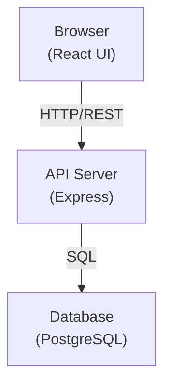
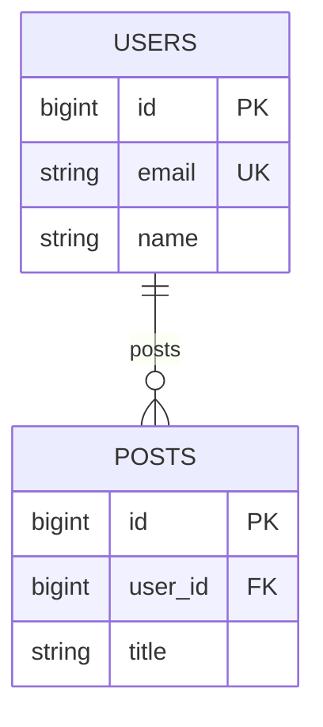

# System Architecture Diagram

The sample project uses a three-tier architecture: a frontend (browser), a backend API server, and a database.

## System Layout

## ER Diagram

Shows the relationships between tables. The users table and posts table have a one-to-many relationship.

## Related Specs

- [[tables:users]] — Users table definition
- [[tables:posts]] — Posts table definition
- [[api:users-api]] — User management API
