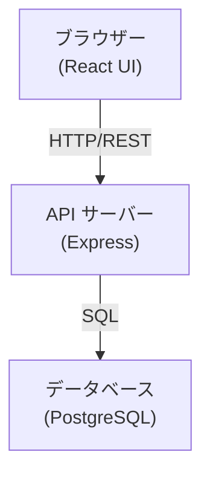
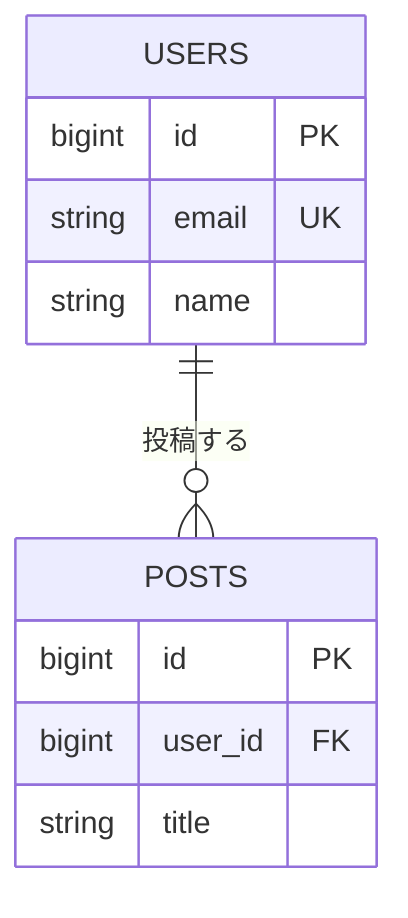

# システム構成図

サンプルプロジェクトは、フロントエンド（ブラウザー）、バックエンド API サーバー、データベースの 3 層構成です。

## システムレイアウト

## ER 図

テーブル間の関連を示します。users テーブルと posts テーブルの 1 対多の関係です。

## 関連スペック

- [[tables:users]] — ユーザーテーブル定義
- [[tables:posts]] — 投稿テーブル定義
- [[api:users-api]] — ユーザー管理 API
